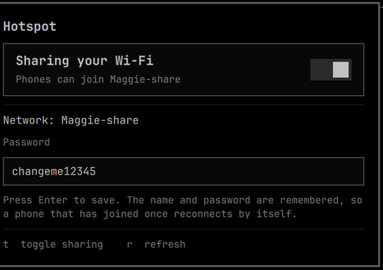

# Hotspot — share your Wi-Fi uplink from the Omarchy bar

Share the laptop's Wi-Fi connection with a phone **without dropping the laptop's own
connection**. A toggle and a password field, nothing else.



## What it's for

One-device Wi-Fi: planes, hotels, conference networks, anywhere a single paid or
authenticated session is all you get. The laptop keeps that session and your phone joins a
local access point whose traffic is routed out through it — so you stop switching the
connection back and forth between devices.

The SSID and password are stored permanently by NetworkManager, so a phone that has joined
once **reconnects on its own** the moment you flip the toggle.

## Is this for you?

| Requirement | Why |
|---|---|
| Wi-Fi adapter supporting **AP mode alongside managed** | The hotspot runs on a virtual interface so your uplink stays up |
| **NetworkManager** | It provides the AP, DHCP, DNS and NAT |
| **`dnsmasq`** installed | NM spawns its own instance for shared mode (do not enable `dnsmasq.service`) |
| `iw`, `nmcli` | Interface creation and configuration |

Check your adapter first:

```bash
iw list | grep -A6 'valid interface combinations'
```

You need a line containing `#{ AP } <= 1` together with `managed`. Note the `#channels`
value on that line — see the limitation below.

Developed on an ASUS ROG Zephyrus G14 (GA403WM) with a MediaTek MT7925, on Omarchy 4 / Arch.

## Install

```bash
omarchy plugin add https://github.com/rawritude/omarchy-hotspot.git --enable
omarchy bar move io.github.rawritude.hotspot --section right
```

Then install the two helpers, which the plugin calls:

```bash
sudo install -Dm755 bin/hotspot-share    /usr/local/bin/hotspot-share
sudo install -Dm755 bin/phone-share-vif  /usr/local/bin/phone-share-vif
sudo install -Dm440 bin/hotspot-share.sudoers /etc/sudoers.d/hotspot-share
sudo visudo -cf /etc/sudoers.d/hotspot-share    # verify before trusting it
sudo pacman -S --needed dnsmasq
```

Edit the sudoers file first and replace the username with your own. It grants **one**
command, and that command validates its own arguments — see below.

## Removing it

```bash
omarchy plugin remove io.github.rawritude.hotspot
sudo rm -f /usr/local/bin/hotspot-share /usr/local/bin/phone-share-vif \
           /etc/sudoers.d/hotspot-share
nmcli connection delete Hotspot     # removes the stored SSID and password
```

`dnsmasq` is left installed since other things may use it. Your own Wi-Fi connections are
untouched.

## Usage

Click the `((•))` icon, set a password (8+ characters, press Enter), flip the toggle.
Your phone sees a network named `<hostname>-share`.

Keys in the panel: `t` toggle, `r` refresh. IPC for keybinds:

```bash
omarchy-shell io.github.rawritude.hotspot toggle
omarchy-shell io.github.rawritude.hotspot on
omarchy-shell io.github.rawritude.hotspot off
```

The CLI works standalone too: `hotspot-share on|off|status|info|set-password|set-ssid`.

## The one real limitation

A Wi-Fi radio usually cannot transmit on two channels at once. On this hardware the
capability line reads:

```
#{ managed, P2P-client } <= 2, #{ AP } <= 1, #{ P2P-device } <= 1, total <= 3, #channels <= 1
```

`#channels <= 1` means **the hotspot must use the same channel as your uplink**. You cannot
run a 2.4 GHz hotspot while connected to a 5 GHz network. The helper reads the uplink's
current channel on every start and pins the AP to it, so this is handled automatically and
adapts as you move between networks — but if your uplink is on a channel your adapter
cannot run an AP on, the hotspot will not start.

## Design notes

**NetworkManager does the work.** `ipv4.method shared` gives the AP, DHCP, DNS and NAT in one
setting. There is no `hostapd` configuration, no hand-written `dnsmasq` config, and no
`iptables` rules to install or clean up. The only reason `dnsmasq` must be installed is that
NM spawns the binary itself.

**The connection profile is created once, then only brought up and down.** Recreating it on
each toggle is what makes a phone treat it as a new network every time; keeping it means the
SSID and PSK are stable and reconnection is automatic.

**One narrow privilege.** Only creating and destroying the virtual AP interface needs root.
The helper that does it validates its arguments — interface names must match
`^[a-z][a-z0-9]{0,14}$` and the base interface must exist — so the sudoers grant cannot be
turned into a general root shell. No polkit rule, and nothing passwordless beyond that single
argument-checked command.

**No shell interpolation.** The password comes from a text field and is passed as an argv
element, never as part of a command string.

## Credits

- **[NetworkManager](https://networkmanager.dev/)** — provides the access point, DHCP, DNS
  and NAT. This plugin is largely a friendly face over `nmcli`.
- **[Omarchy](https://github.com/basecamp/omarchy)** by Basecamp (MIT) — the shell, its
  plugin system, and the `Toggle`, `TextField` and `KeyboardPanel` components the panel is
  built from.
- **[Quickshell](https://git.outfoxxed.me/quickshell/quickshell)** by outfoxxed (LGPL-3.0) —
  the QML shell framework, and `Process`/`StdioCollector` for talking to the helper.
- **[omarchy-hotspot](https://github.com/shivamnarkar47/omarchy-hotspot)** by shivamnarkar47
  (MIT) — an independent implementation of the same idea, read while building this one. It
  takes a different route (hostapd, a hand-configured dnsmasq, explicit iptables NAT and a
  polkit rule); this plugin leans on NetworkManager instead. Worth a look if you need the
  control that approach gives you.

## License

MIT — see [LICENSE](LICENSE).
